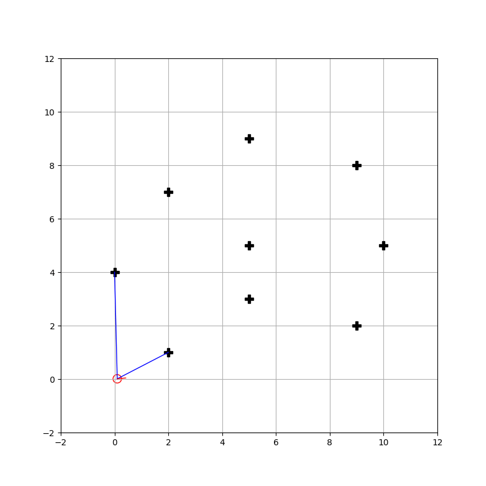

# Robot Mapping Course Solution using Python

... ing

## Requirement

- matplotlib (3.5.3)
- numpy (1.23.1)
- celluloid (0.2.0)
- ffmpeg (4.2.7)

```shell
pip install matplotlib
pip install numpy
pip install celluloid
sudo apt install ffmpeg
```

## Result

| Assignment                   | Animation / Image                                                            |
| ---------------------------- | ---------------------------------------------------------------------------- |
| **1** - Tutorial             |                                        |
